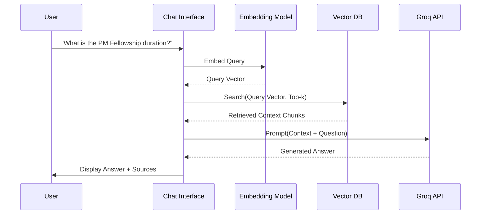

# NextLeap Chatbot Architecture Design

## 1. System Overview
The **NextLeap Chatbot** is an AI-driven conversational agent designed to assist users with inquiries about NextLeap’s product management courses, fellowships, and community resources. The system leverages **Retrieval-Augmented Generation (RAG)** to provide accurate, context-aware answers grounded in NextLeap's official content, ensuring minimal hallucinations.

Key Technologies:
*   **LLM Inference**: **Groq API** (Llama 3 70B / Mixtral 8x7b) for ultra-low latency responses.
*   **Vector Database**: **Pinecone** or **Qdrant** for storing and retrieving high-dimensional embeddings.
*   **Orchestration**: **LangChain** or **LlamaIndex** framework.

---

## 2. Phase-Wise Architecture

### Phase 1: Data Scraping and Preprocessing

**Goal**: To build a comprehensive knowledge base from NextLeap's digital footprint.

#### Architecture Components:
1.  **Crawlers / Scrapers**:
    *   **Public Website Crawler**: A Python-based crawler (using **Scrapy** or **BeautifulSoup**) targeting `https://nextleap.app/`. It will index:
        *   **Course Pages**: Curriculum details, pricing, FAQs.
        *   **Blog/Resources**: Educational articles on Product Management.
        *   **Community Pages**: Public success stories and alumni testimonials.
    *   **Document Ingestion**: Parsing of PDF brochures or Notion pages if available.

2.  **Preprocessing Pipeline**:
    *   **HTML Cleaning**: Removing boilerplate (navbars, footers, ads) to extract raw text content.
    *   **Metadata Extraction**: capturing source URL, title, and last updated date for citation.
    *   **Normalization**: Standardizing text encoding, removing excessive whitespace.

#### Data Flow:
`[NextLeap Website] --> (Scraper) --> [Raw HTML] --> (Cleaner) --> [Cleaned Text Corpus]`

---

### Phase 2: Text Embedding Generation and Vector Storage

**Goal**: To transform the knowledge base into a searchable vector format.

#### Architecture Components:
1.  **Chunking Strategy**:
    *   **Recursive Character Splitter**: Splitting text into chunks of **500-1000 tokens** with a **100-200 token overlap** to maintain context across boundaries.
    *   **Semantic Chunking**: Grouping sentences based on semantic similarity (advanced option).

2.  **Embedding Model**:
    *   **Model Selection**: `sentence-transformers/all-MiniLM-L6-v2` (for speed/local) or **OpenAI text-embedding-3-small** (for higher quality).
    *   **Dimensions**: 384 (MiniLM) or 1536 (OpenAI).

3.  **Vector Database**:
    *   **Storage**: Storing embeddings along with metadata (Source URL, Chunk Text).
    *   **Index**: HNSW (Hierarchical Navigable Small World) index for fast approximate nearest neighbor search.

#### Data Flow:
`[Cleaned Corpus] --> (Chunker) --> [Text Chunks] --> (Embedding Model) --> [Vector Embeddings] --> (Vector DB)`

---

### Phase 3: Query Handling and Response Generation (RAG)

**Goal**: To answer user queries accurately using the retrieved context and Groq LLM.

#### Architecture Components:
1.  **User Interface**:
    *   A simple chat interface (Streamlit / React) accepting user text input.

2.  **Retrieval System**:
    *   **Query Embedding**: Converting user question into a vector using the *same* model from Phase 2.
    *   **Semantic Search**: Querying the Vector DB for top **k=3 to 5** most relevant chunks based on **Cosine Similarity**.

3.  **LLM Generation (Groq)**:
    *   **Prompt Construction**: Dynamically building a prompt that includes:
        *   System Instruction ("You are a helpful assistant for NextLeap...")
        *   Retrieved Context (The 3-5 chunks from Vector DB)
        *   User Question
    *   **Inference**: Sending the prompt to **Groq API** (`llama3-70b-8192` model).
    *   **Response Parsing**: Formatting the answer and appending citations based on metadata.

#### Data Flow (Run-time):

---

## 3. Technology Stack Summary

| Component | Technology Choice | Reason |
| :--- | :--- | :--- |
| **LLM Provider** | **Groq** | Exceptional inference speed (LPU), crucial for chat latency. |
| **Model** | **Llama 3 70B** | High reasoning capability, open weights, supported on Groq. |
| **Vector DB** | **Pinecone** / **Chroma** | Managed service (Pinecone) or ease of local dev (Chroma). |
| **Embeddings** | **HuggingFace** / **OpenAI** | Industry standard performance. |
| **Framework** | **LangChain** | robust abstraction for RAG pipelines. |
| **Scraper** | **BeautifulSoup** | Efficient for static content extraction. |
